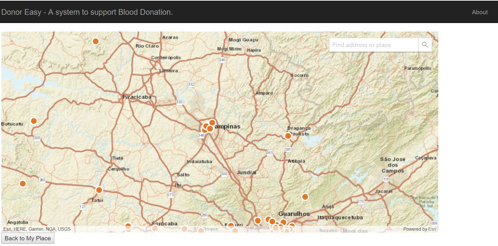
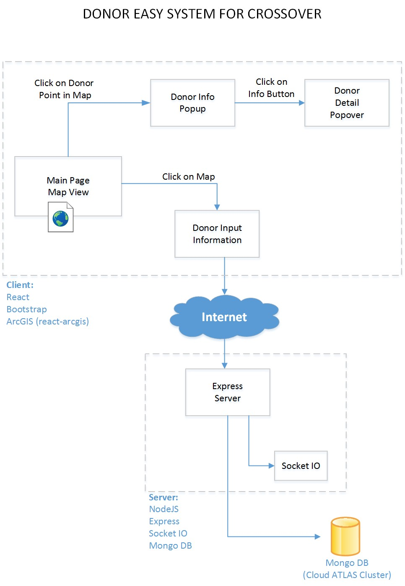

# react-easydonor
React app for donor system for competition. It is a SPA app to support map visualization, placement and search of donors as pins in maps.
The server repository is dpetrini/easydonor.

Use Mouse Wheel to Zoom in and out in the map.
If you click on a point, a Popup will show the Donor information without contact info.
If you press the button in the popup you will see the contact info. It is a requirement to prevent from bots to retrieve emails.
You can create a new point by clicking anywhere in the map. 
A popup will request Donor information. Please enter information. Some fields are required and email and phone fields requests proper formatting as well as blood type selection.

After you enter Donor info, click Submit button to send it to Mongo DB server through Node Express app.

You can see "real-time" update of new donor after you submit, as well as a popup containing the URL for edit your data if you wish.

You can see "real-time" update of new donor in other Chrome browser window in same time. This is achieved by socket communication 
by same node server. Again, please make mouse wheel scrolling for zoom in or out to see the changes.

You can navigate in maps to see other donors.

Live demo: https://easydonor.herokuapp.com/



* [Technical Stack](#technical-stack)
* [Architecture](#architecture)
* [Main features](#main-features)
* [Tests](#tests)
* [How to Run](#how-to-run)
* [Missing Features](#missing-features)

## Technical Stack
* Language - JavaScript/ES6/ES7/Babel. React components are written on ES6/ES7 using Browserify, Babel transpiler.
* Socket.io - realtime updates
* Back-end - Node.js/Express.js, Mongojs/MongoDB (repository dpetrini/easydonor)
* Front-end -  React/React Router/ ArgCIS react component / ARGCIS maps
* React-Bootstrap for clean UI and CSS basis
* Tests - Jest
* Webpack, ESLint, VSCode

## Architecture
The application is built in client-server architecture with Node.js back-end and React front-end. The front-end
is organized in many components to handle specific tasks.
The full stack app is organized as below:



## Main features
The main features are:
* Maps visualization
* Donors pins in map as red balls
* Click on donor to see name and click in pop to see contact info
* Database: mongoDB
* ARCGIS maps and real time update
* Insert new donor in any place in map
* Real time notification of new donor (appear on map) in other browsers simultaneously
* Bootstrap clean look and feel
* See about for operation instructions

## Tests

```
Jest tests of main components:
npm jest
```

## How to Run

Needs to install the backend counterpart before and start the server and local (or remote) mongo database.
Express server for this app: https://github.com/dpetrini/easydonor.

Using npm:
```
$ npm install
$ grunt watch
```

Open in your browser
```
http://localhost:8080 
```

## Missing Features
* Increase and improve Jest tests
* Improve UI
